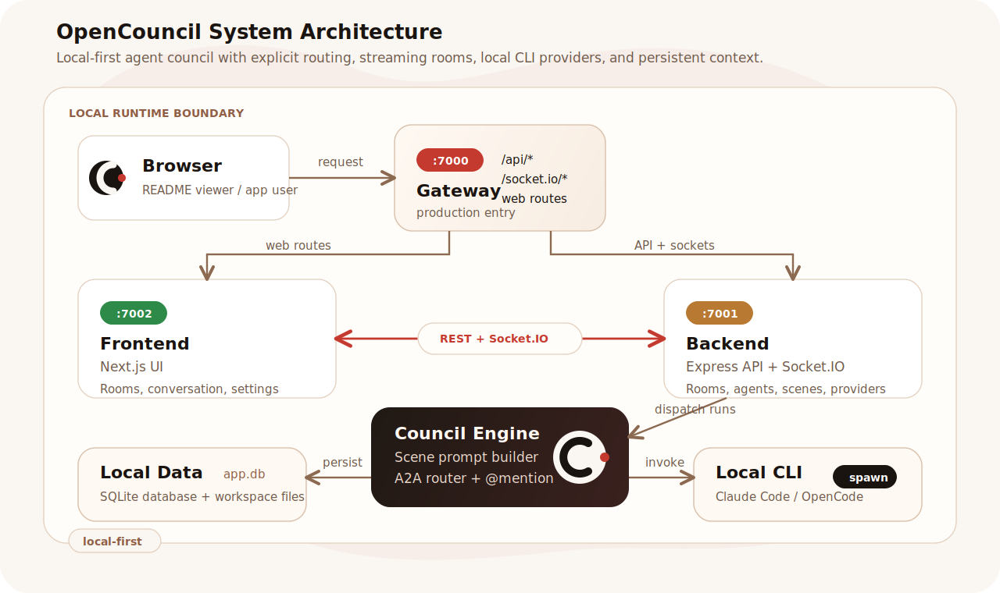

# OpenCouncil

<p align="center">
  
</p>

<p align="center">
  中文 | <a href="README.en.md">English</a>
</p>

> Custom agent councils for real work.

OpenCouncil 把“一个 AI 单独回答”升级成“一场可编排的专家会”。你可以为不同任务创建 Scene，例如功能评审、架构决策、市场调研或代码实现，再把不同角色的 Agent 放进同一个房间。

每条消息都可以明确路由给某位 Agent；Agent 之间也能通过 `@mention` 互相追问、质疑和补充。讨论过程会保留在本地上下文里，并可结合 Workspace 与报告能力，把想法推进到方案、任务甚至代码。

它适合那些“一个 Agent 总是差一点”的工作：需要第二意见、交叉验证、多角色视角和可复用流程。


https://github.com/user-attachments/assets/8ad8797a-482b-48b6-a13d-a17b2d858481

## 核心能力

- **自定义场景与 Agent**：按项目配置不同 Scene、专家角色、Provider、模型和工作目录
- **多专家协作**：一个讨论室可包含 1 位或多位专家（`WORKER`）
- **显式路由**：每条用户消息都明确发给某一位目标专家
- **A2A 协作链**：专家回复过程中可以继续 `@mention` 其他专家参与讨论
- **场景化工作流**：支持从问题讨论、方案质疑到任务拆解、报告生成的完整流程
- **本地持久化**：房间、消息、Provider、Scene、Agent 配置都落在本地 SQLite

## 适用场景

- 让多个 AI 专家围绕一个问题进行讨论、挑战和收敛
- 为代码方案、架构决策、需求拆解提供多视角意见
- 让人物视角型专家围绕同一议题做 roundtable 辩论
- 在同一个房间里保留上下文、工作目录和最终总结

## 系统架构

生产模式使用统一入口 `7000`，开发模式默认仍保持前后端分离：

<p align="center">
  
</p>

- `Gateway :7000`：生产模式统一入口，按路径把 `/api/*` 和 `/socket.io/*` 转发给后端，其余请求交给前端
- `Frontend :7002`：Next.js 房间列表、专家协作房间和 Agent / Provider / Scene 设置页
- `Backend :7001`：Express API + Socket.IO，负责消息、房间、报告、配置、Workspace 浏览和流式事件
- `Council Engine`：构建 Scene Prompt，执行 A2A `@mention` 路由和 Agent run 状态机
- `Local AI CLI Providers`：通过 `child_process` 调用 Claude Code / OpenCode 等本地 CLI
- `Local Data`：SQLite 保存房间、消息、Provider、Scene、Agent 配置；Workspace 文件留在本地

## 前置依赖

### 1. Node.js 20.19+ / 22.12+ 至 25.x

```bash
node --version
```

仓库根目录提供了 `.nvmrc` / `.node-version`，默认推荐 Node 22.22.1。`dev/build/test` 现在会在启动前显式校验当前依赖真实支持的 Node 范围，不再只锁死在 22.x，也不会让不兼容的版本一路运行到半路才报 native / bundler 错误。

CI 会在 Linux、macOS、Windows 上覆盖 Node 20.19.x、22.x、24.x、25.x。Node 23.x 也在本地版本门禁支持范围内。Node 18 和 21 不在支持范围内；当前后端测试工具链和 `better-sqlite3` native binding 不支持它们。

### 2. pnpm 10.x

```bash
pnpm --version
```

### 3. 至少安装一个本地 AI CLI

#### Claude Code

```bash
npm install -g @anthropic-ai/claude-code
claude --version
```

#### OpenCode

参考 [OpenCode 官网](https://opencode.ai) 安装后确认：

```bash
opencode --version
```

## 快速开始

### 克隆仓库

```bash
git clone https://github.com/yulong-me/OpenCouncil.git
cd OpenCouncil
```

### 安装依赖

```bash
pnpm install:all
```

`backend` 使用 `better-sqlite3`。从现在开始，`pnpm dev` / `pnpm --dir backend build` / `pnpm --dir backend test` 会在启动前自动检查并按当前 Node 版本重建 native binding，因此即使开发者切换过 Node 版本，也不会再在运行时才因为 ABI 不匹配崩掉。

### 可选环境变量

后端支持通过 `backend/.env` 调整日志级别：

```bash
LOG_LEVEL=info
```

若前后端不在同一地址，或你需要覆盖默认 API 地址，可在 `frontend/.env.local` 中指定后端地址：

```bash
NEXT_PUBLIC_API_URL=http://localhost:7001
```

默认情况下不需要设置这个变量：

- `pnpm dev` 会在浏览器访问 `7002` 时自动请求 `7001`
- `pnpm dev:gateway` / `pnpm start` 会在浏览器访问 `7000` 时自动走同源入口

### 启动本地开发环境

```bash
pnpm dev
```

当前默认会同时启动分离开发模式：

| Service | URL |
|---------|-----|
| Backend API | http://localhost:7001 |
| Frontend UI | http://localhost:7002 |

如果你想在本地模拟生产统一入口，可选运行：

```bash
pnpm dev:gateway
```

此时会启动：

| Service | URL |
|---------|-----|
| Gateway | http://localhost:7000 |
| Backend API (internal) | http://localhost:7001 |
| Frontend UI (internal) | http://localhost:7002 |

首次启动时会自动创建 SQLite 数据库：

- `backend/data/muti-agent.db`

默认运行时目录也都位于 `backend/` 下：

- `backend/data/`
- `backend/logs/`
- `backend/workspaces/`

### 构建

根目录现在提供统一构建入口：

```bash
pnpm build
```

它会顺序执行：

- `pnpm run build:backend`：把后端 TypeScript 编译到 `backend/dist`
- `pnpm run build:frontend`：执行 Next.js 生产构建，产物位于 `frontend/.next`

如果只想单独构建某一侧，也可以直接运行：

```bash
pnpm run build:backend
pnpm run build:frontend
```

### 正式运行

先构建，再用正式启动入口运行：

```bash
pnpm build
pnpm start
```

生产模式会启动统一入口网关，对外默认访问地址为 `7000`：

| Service | URL |
|---------|-----|
| Gateway | http://localhost:7000 |
| Backend API (internal) | http://localhost:7001 |
| Frontend UI (internal) | http://localhost:7002 |

如果本机 `7000` 已被占用，可临时覆盖：

```bash
GATEWAY_PORT=7100 pnpm start
GATEWAY_PORT=7100 pnpm dev:gateway
```

### 进入产品

开发分离模式：

1. 打开 [http://localhost:7002](http://localhost:7002)
2. 进入设置，先配置 Provider
3. 创建房间，选择一个或多个专家
4. 在输入框中通过 `@专家名` 或 mention picker 指定接收专家后发送消息

生产统一入口模式：

1. 打开 [http://localhost:7000](http://localhost:7000)
2. 进入设置，先配置 Provider
3. 创建房间，选择一个或多个专家
4. 在输入框中通过 `@专家名` 或 mention picker 指定接收专家后发送消息

## 配置说明

### Provider

在设置页的 Provider 标签中维护：

- CLI 路径
- API Key
- Base URL
- 默认模型
- 推理开关

### Agent

在设置页的 Agent 标签中维护：

- 角色名和展示标签
- Provider 绑定
- Agent 级模型覆盖
- System Prompt
- 启用状态
- 标签

### Scene

在设置页的 Scene 标签中维护：

- 场景名称与说明
- Prompt 模板
- 内置场景与自定义场景

## 内置人物专家

仓库默认保留一批内置人物视角专家。这些人物 prompt 来源于：

- [.agents/skills](./.agents/skills)

如果你希望 fresh DB 启动后仍然自动具备这些人物专家，请不要删除这个目录。
