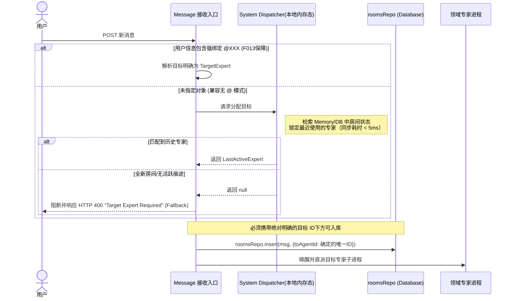

# F012: 移除 MANAGER 角色，演进为系统级基础路由与容错模型

> Status: done | Owner: sonnet

## Why

目前我们在讨论室中依赖了一个拟人化的“MANAGER/主持人”角色来进行意图澄清、专家分发乃至 A2A 兜底和报告生成。这导致了极为严重的逻辑耦合；而该角色的存在又成了消息处理链路的寄生依赖。

此次重构旨在通过废除 MANAGER 角色，让消息成为纯粹的 **"用户 + 专业 Experts"** 间的对谈。由于系统的多个底层逻辑（报告生成、异常回退）皆深度绑定了该角色，因此不仅要修改路由机制，更要补齐“后 Manager 时代”的关键行为填补（Fallback 接手者）。

*(注：系统处于未发布阶段，无需承担历史遗留功能的数据兼容包袱，重点在于架构前置及链路疏通。)*

## What

拆除 MANAGER 组件带来的连锁反应必须得到系统化解绑与前置：

1. **接口与消息路由前置与强拦截（解决 P1 & P2 & Fallback）**：
   - 入口层（Controller）首先解析用户的明确 `@` 指定目标或者依靠纯代码逻辑判断“最近一次使用的专家”（同步操作，耗时极短）。
   - **Fallback 兜底拦截**：如果未明确 `@` 指定，且当前房间完全没有任何活跃互动（如全新房间的首次发言），Gateway 将**直接抛出 HTTP 400 (Target Expert Required)** 并中断执行。不产生任何悬空消息，强迫前端阻拦。
   - **路由彻底前置**：在消息进入 `roomsRepo.insert()` 前就已经打上精准的 `toAgentId` 烙印，杜绝现有的“先按无对象存表、再修改分配”逻辑。
2. **核心业务下沉（解决缺接手者问题）**：
   - **报告生成 (Report)**：剥离到独立无状态的系统级服务（Report Service）按需生成，暴露为独立的 API 收口。
   - **A2A 深度回退 (A2A Fallback)**：Agent-to-Agent 对话达讨论深度上限时，不再丢回给 Manager 收口，而是由系统直接发下一条 `SystemMessage` 到公屏：“[系统提醒] 业务内部探讨达到上限，请您介入引导方向”。
3. **消除 Scope 矛盾**：
   - System Dispatcher **仅执行 1对1 (确定性) 单目标路由**；不再具备将其随意分发给多个专家并发的能力。
4. **测试数据强制清理（解决 P3）**：
   - 因为系统尚未发布，原包含乱七八糟 MANAGER “statement”等噪音的数据库直接执行物理抹除或重置重建，不做前端向下展示兼容。

## In Scope

- **清理 MANAGER 实体与依赖**：
  - 更新默认数据库 Seed 初始化代码，移除 Manager 基础定义。
  - 断开“新建房间”必然绑定默认 Host 的约束机制。
- **后端架构前移解析**：
  - 核心入口链路确保先做 Dispatch 决策逻辑或直接 400 阻拦，成功后再做持久化（入库）。
- **重置兜底业务流**：
  - A2A 深度限制触发器，修正为前端展示纯系统拦截卡片。
  - 提取报告撰写的核心功能为 `/api/report` API。
- **环境预热及旧数据销毁**：
  - 执行 `DB Reset` 抛弃包袱。

## Out of Scope

- 基于 LLM 意图分析的复杂调度策略。
- 历史老版本 UI 向下垫片兼容及降级渲染保护。

## Dependencies (与 F013 的关系)

- **开发并行与兜底依赖**：@ExpertName 的强制校验在体验层属于 [F013] 的范畴（前端不允许发送无目标的消息）。
- 如果 F013 尚未完成或被绕过，F012 这边的后端路由策略会自动承担**最后一道防线**：遇到无明确 `@` 且 Dispatcher 推算不到活跃历史（即返回空）时，直接以 `400 Bad Request` 报错，从库源头上杜绝了非法消息和脏数据。

## System Architecture / Routing Workflow

## Acceptance Criteria

- [x] **AC-1: 数据依赖分离**：`db/index.ts` seed 移除 `host` MANAGER 实体，`SEEDED_IDS` 不再含 `host`，不再有主持人身份。
- [x] **AC-2: 路由决断严防死守**：`POST /api/rooms/:id/messages` 前置路由逻辑，无 `toAgentId` 时找最近活跃 WORKER，找不到则 HTTP 400；`stateMachine.routeToAgent()` 不再依赖 MANAGER，`toAgentId` 为必需参数。
- [x] **AC-3: 报告重组规约**：`POST /api/rooms/:roomId/report` 端点（`generateReportInline`），使用 WORKER 执行，无状态，不依赖 MANAGER。
- [x] **AC-4: A2A 纯事件收口**：`a2aOrchestrate()` 深度达上限时调用 `addSystemMessage()` 写入 System 卡片，不再返回 `manager_handoff`。
- [x] **AC-5: 性能红线指标 (KPI)**：`System Dispatcher` 路由为纯内存同步操作，无网络调用，理论上 < 5ms。

## Proposed Changes

- **初始化与清库限制**：`backend/src/db/seed.ts` 全面剥除经理身份模型。
- **服务分发层**：修改 / 重构接收 `POST` 到分发逻辑链路的 `RouterService` / `MessageController`，实现 400 Fallback 拦截和前置目标附身。
- **报告模块提取**：
  - 新增 Endpoint: `POST /api/rooms/:roomId/report`
  - 请求/响应要求：无正文入参，系统基于 `roomId` 取对话，响应返回结构化的 JSON Report 数据 `{ summary: string, actionItems: [] }`。
- **A2A 退守边界**：将 `Worker/Agent` 处理 A2A 的退守边界 `max_depth`，切改为抛出给系统而非 Call Manager。
