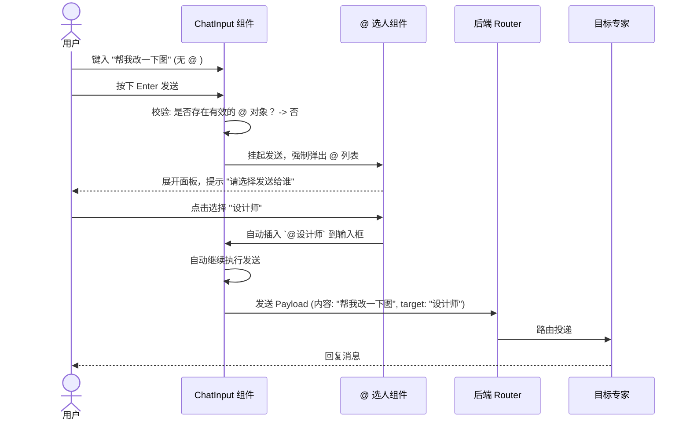

# F013: 强制显式路由（Mandatory @-Mention）机制

> Status: done | Owner: sonnet

## Why

在多专家协作场景下，依赖隐含规则（例如发给“默认主持人”或由系统隐式分发给“最近交互的专家”）容易带来以下体验痛点：
1. **预期不确定**：用户在发消息前，如果不进行显式的 `@`，心里会缺乏确界感，容易导致发错人。
2. **交互成本后置**：“发错人”导致的召回、要求另一专家接手等操作成本，远大于“发送前强制确认发送给谁”。
3. **系统复杂性高**：任何隐式的路由调度（无论用 LLM 还是历史状态追踪），都需要大量的兜底设计。
4. **利用现有资产**：前端目前已经拥有成熟的 `@` 选人组件。如果将“发送给谁”的动作前置，将使得消息流向百分百明确。

综上，最简单有效的多专家讨论室通信协议就是**“强制显式路由”**——没有 `@` 受件人的消息，不允许发送。

## What

取消任何形式的“默认收件人”或“后台隐式路由”，在输入交互层面强制要求每条消息必须有指向性（Targeted）。
1. **输入拦截**：当用户在输入框键入内容并尝试按下回车（或点击发送）时，若系统中未探测到有效的 `@专家` 目标，拦截发送流程。
2. **触发选人**：拦截发送的同时，在输入光标处立即弹出已有的 `@` 选人组件（Mention Menu），强制要求用户选择一位专家。
3. **视觉可见即所得**：如果是为了延续语境（比如刚和设师聊完），输入框可**自动附带展示 `@设计师` 的标签**，用户可见可变，一切路由判定仅以输入框内显式的 `@标记` 为准。

## In Scope

- **前端输入校验拦截**：`ChatInput` 组件在 `onSubmit` 前校验消息文本或状态中是否包含合法的 `toAgentId`/`mentions`。
- **自动唤醒 `@` 组件**：发送校验失败时，直接触发并唤起现有的 `@` Menu 组件，并高亮提示“请选择发送对象”。
- **上下文继承（视觉显性化）**：为了降低输入摩擦，可以实现“点击回复某人”或“延续上下文”时，在输入框**主动预填 `@专家` badge**。这依然是显式的。
- **后端纯净度**：后端的 Router 不再需要复杂的调度策略，只需简单断言 `toAgentId` 必填，缺失直接报错。

## Out of Scope

- 隐式路由策略（完全摒弃隐含的调度，废弃部分 F012 的后台探测机制）。
- 意图分析与 LLM 调度节点。

## System Architecture / Workflow

### 交互时序图如下：

## Acceptance Criteria

- [x] AC-1: **发送拦截** - 当输入框内没有 `@` 任何一个合法专家时，点击发送按钮或按回车键，消息**不会**发出。
- [x] AC-2: **强制唤起组件** - 在触发拦截的瞬间，输入框内自动弹出标准的 `@` 选人菜单。
- [x] AC-3: **选择后顺滑发送** - 用户在弹出的菜单中点击某专家后（或用键盘选择后），补齐 `@信息` 并可以将之前拦截的消息自动送出，或者保留在输入框等待用户二次确认发送（视 UX 决定）。
- [x] AC-4: **后端强校验** - 移除后端所有的 fallback 默认路由，将 `toAgentId` / `mentioned_agents` 设为消息接口的必须参数。
- [x] AC-5: **消除”全局发话”歧义** - 会话流中每一句 User 的发问，视觉上都明确展现它是 `to @某人` 的。

## Implementation Notes

- **前端 `RoomView_new.tsx`**（核心实现）：
  - `handleSendMessage` 前置校验：若 `extractMentions(userInput).length === 0`，打开 `@插入` picker 并 return，不发出请求。
  - **路由单一真相源**：`toAgentId` 从 `extractMentions(content)` 派生（取第一个 mention name → 匹配 agent.id）。`selectedRecipientId` 仅用于遥测/展示，不参与路由。
  - Send button 仅校验 `!userInput.trim()`，不禁用无收件人状态。
  - 无任何默认收件人（删除 MANAGER fallback 和 WORKER-first default）。
  - `@插入` picker 过滤 `role !== 'MANAGER'`，选中时向 textarea 光标处插入 `@agentName `。
  - 400 错误时显示"未找到指定专家，请检查 @ 后的名字"。
- **前端 `MentionQueue.tsx`**：
  - "主持人提名" → "邀请发言"（无 MANAGER 角色）。
- **后端 `rooms.ts`**：
  - 移除 `lastActiveWorker` fallback 路径。
  - `!toAgentId` → HTTP 400 "Target Expert Required: toAgentId is mandatory"。
  - `target!.id` 非空断言（前置检查已保证 target 存在）。
